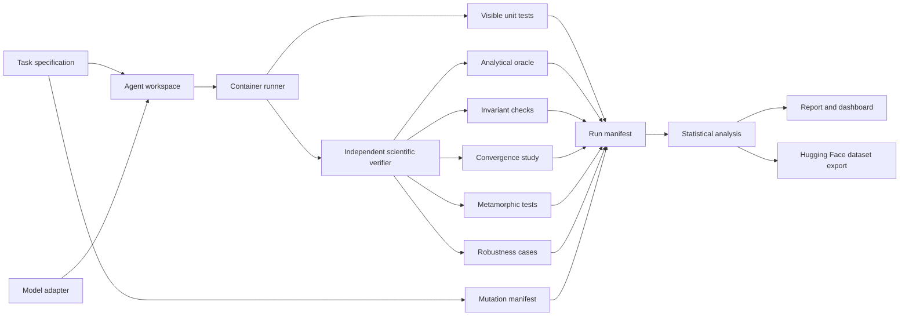

# InvariantLab

> Physics-grounded evaluation for AI-generated scientific software.

InvariantLab measures whether an AI coding agent has implemented the declared mathematics—not merely produced code that compiles or passes a narrow set of examples.

The benchmark uses compact problems from classical mechanics and numerical partial differential equations. Every task pairs an agent-facing implementation with independent analytical, numerical, invariant, convergence, and metamorphic checks. Controlled defect injection makes the source of each failure known, while containerised execution and immutable run manifests make results reproducible.

The central research question is:

> **How often do coding agents produce numerical programs that pass ordinary unit tests but violate physical invariants, convergence requirements, or analytical solutions—and which verification methods close that gap?**

InvariantLab contains no biological, medical, genomic, chemical, or wet-laboratory data, models, or workflows. Its scientific scope is classical mechanics, numerical analysis, and deterministic software evaluation.

---

## Contents

- [Scientific motivation](#scientific-motivation)
- [V1 scope](#v1-scope)
- [System architecture](#system-architecture)
- [Task contract](#task-contract)
- [Verification stack](#verification-stack)
- [Controlled defect injection](#controlled-defect-injection)
- [Evaluation protocol](#evaluation-protocol)
- [Metrics](#metrics)
- [Reproducible outputs](#reproducible-outputs)
- [Repository structure](#repository-structure)
- [Command-line interface](#command-line-interface)
- [Dashboard](#dashboard)
- [Testing and acceptance criteria](#testing-and-acceptance-criteria)
- [Scientific limitations](#scientific-limitations)
- [References](#references)

---

## Scientific motivation

Execution is not scientific correctness.

A numerical program can run successfully and still solve the wrong problem. It may apply an incorrect sign convention, impose the wrong boundary condition, use an unstable timestep, lose a conserved quantity, report false convergence, or work only for the single example exposed by its tests.

Ordinary unit tests are often too narrow to reveal these errors. InvariantLab treats scientific verification as a layered evidence problem:

\[
\text{specification}
\rightarrow
\text{implementation}
\rightarrow
\text{independent oracle}
\rightarrow
\text{controlled experiment}
\rightarrow
\text{quantitative result}
\rightarrow
\text{reproducible artefact}.
\]

The benchmark therefore separates two notions of success:

1. **Visible success** — the implementation passes the tests available to the coding agent.
2. **Scientific success** — the implementation also satisfies independent analytical, invariant, convergence, metamorphic, and robustness checks.

The difference between these outcomes is the **verification gap**.

---

## V1 scope

V1 uses four bounded problem families with complementary numerical failure modes.

| Task | Governing model | Reference evidence | Primary properties |
|---|---|---|---|
| Harmonic oscillator | $\ddot{x}+\omega^2x=0$ | Closed-form trajectory | Energy, phase, reversibility, convergence |
| Kepler two-body orbit | $\ddot{\mathbf r}=-\mu\mathbf r/\lVert\mathbf r\rVert^3$ | Circular-orbit solution and high-accuracy integration | Energy, angular momentum, rotational covariance |
| One-dimensional heat equation | $u_t=\alpha u_{xx}$ | Manufactured sinusoidal solution | Stability, boundary conditions, diffusion rate, convergence |
| One-dimensional wave equation | $u_{tt}=c^2u_{xx}$ | Standing/travelling-wave solutions | Wave speed, energy behaviour, boundary conditions, convergence |

These tasks are small enough to execute repeatedly while still exposing scientifically meaningful defects. V1 deliberately favours depth of verification over broad domain coverage.

### Harmonic oscillator

The reference solution is

\[
x(t)=x_0\cos(\omega t)+\frac{v_0}{\omega}\sin(\omega t),
\]

with total energy

\[
E=\frac{1}{2}v^2+\frac{1}{2}\omega^2x^2.
\]

The task supports tests for phase error, long-horizon energy drift, timestep convergence and time reversal.

### Kepler two-body orbit

The specific orbital energy and angular momentum are

\[
\varepsilon=\frac{\lVert\mathbf v\rVert^2}{2}-\frac{\mu}{\lVert\mathbf r\rVert},
\qquad
\mathbf h=\mathbf r\times\mathbf v.
\]

The verifier checks orbital-state accuracy, bounded conservation drift and covariance under rigid rotations. Circular cases provide an analytical reference; non-circular cases are compared with a separately implemented high-accuracy oracle.

### Heat equation

For homogeneous Dirichlet boundaries, a manufactured solution is

\[
u(x,t)=\sin(\pi x)e^{-\alpha\pi^2t}.
\]

The verifier checks boundary enforcement, decay rate, stability restrictions and empirical spatial/temporal convergence.

### Wave equation

Standing-wave cases provide exact displacement and velocity fields. Verification covers wave speed, phase accuracy, boundary treatment, energy behaviour and sensitivity to the Courant number.

---

## System architecture



### Design principles

- **Independent verification:** production and oracle paths do not share numerical update code.
- **One controlled defect at a time:** each mutated task has a known causal label.
- **Deterministic replay:** task, model, prompt, seed, tool budget and container digest are recorded.
- **No LLM ground truth:** language-model judgments may be compared experimentally, but never define scientific correctness.
- **Fail closed:** missing, malformed or non-finite output cannot receive a scientific pass.
- **No aggregate-only reporting:** every headline result can be reconstructed from committed sample-level records.

---

## Task contract

Each task is a self-contained directory with a machine-readable contract.

```yaml
id: kepler_verlet_force_sign
family: kepler_two_body
language: python
entrypoint: src/solver.py
public_tests: tests/public
scientific_tests: tests/scientific
mutation:
  family: sign_error
  location: acceleration
  expected_effect: orbital_energy_drift
budgets:
  wall_seconds: 900
  model_tokens: 32000
numerics:
  dtype: float64
  seed: 1729
  tolerances:
    state_relative_l2: 1.0e-5
    energy_relative_drift: 1.0e-6
```

A task package contains:

- a concise natural-language specification;
- a starter repository;
- public tests visible to the agent;
- scientific tests mounted only during evaluation;
- a mutation manifest retained by the evaluator;
- a trusted reference result or analytical solution;
- resource limits;
- declared numerical tolerances and their justification.

Tolerance values are attached to individual tasks. They are not shared indiscriminately across different equations, discretisations or floating-point precisions.

---

## Verification stack

### Layer 0 — execution and schema

The implementation must:

- terminate within its resource budget;
- return the declared output schema;
- avoid NaN and infinity;
- preserve expected array dimensions and dtypes;
- write only within the task workspace.

### Layer 1 — visible unit tests

Public tests cover interface behaviour and a small number of ordinary examples. They provide useful development feedback but intentionally do not constitute scientific certification.

### Layer 2 — analytical and high-accuracy oracles

Closed-form solutions are used wherever possible. Cases without a convenient closed form use an independently implemented high-accuracy solver with substantially tighter tolerances than the agent-facing method.

Oracle independence is audited at the source level: the agent implementation, task mutation and verifier cannot import one another’s numerical update functions.

### Layer 3 — invariant checks

Invariant checks measure properties that should remain constant or evolve monotonically under the declared model:

- total energy;
- angular momentum;
- reversible-state recovery;
- boundary values;
- norm decay under diffusion;
- finite and physically admissible state.

Checks report the measured deviation as well as pass/fail status.

### Layer 4 — convergence studies

Given errors $E_h$ and $E_{h/2}$ at successive resolutions, the observed order is

\[
p=\frac{\log(E_h/E_{h/2})}{\log 2}.
\]

The verifier records the complete refinement table. A decreasing residual alone is not accepted as evidence that the numerical solution converges to the correct continuum solution.

### Layer 5 — metamorphic tests

Metamorphic relations generate new cases whose transformed outputs are known even when a single exact output is inconvenient to store.

Examples include:

- translating an oscillator’s time origin;
- rotating a Kepler initial state and rotating the result back;
- converting a physically identical case between consistent unit systems;
- reversing a reversible trajectory;
- halving the timestep while holding the physical horizon fixed;
- scaling a linear PDE solution by a constant.

### Layer 6 — held-out robustness cases

Held-out cases vary:

- initial conditions;
- grid and timestep resolution;
- physical parameters;
- integration horizon;
- boundary configurations;
- floating-point stress conditions.

These cases distinguish general numerical reasoning from patches that target one exposed fixture.

---

## Controlled defect injection

InvariantLab uses deterministic, reviewable mutations rather than relying only on naturally occurring failures.

| Mutation family | Example | Typical scientific symptom |
|---|---|---|
| Sign error | Reverse the restoring-force sign | Exponential growth or incorrect orbit |
| Update-order error | Reuse an already updated state component | Broken reversibility and excess drift |
| Boundary error | Apply a condition at the wrong index | Wrong PDE solution despite stable execution |
| Discretisation error | Use $\Delta x$ instead of $\Delta x^2$ | Incorrect convergence and grid dependence |
| Stability error | Ignore the explicit CFL restriction | Resolution-dependent instability |
| Unit error | Treat degrees as radians | Plausible but systematically wrong trajectory |
| Non-conservative update | Perturb only one coupled state equation | Energy or momentum leakage |
| Hard-coded shortcut | Special-case the public fixture | Public pass and held-out failure |
| Precision defect | Downcast a sensitive calculation | Long-horizon divergence |
| Termination defect | Report convergence at an iteration cap | False convergence claim |

Each accepted mutant must satisfy three checks:

1. the correct reference implementation passes all verifier layers;
2. the mutant passes its designated weak public test profile;
3. the mutant fails at least one predeclared scientific property for the expected reason.

Property-based tests also confirm that a mutation intended to represent one defect family does not silently introduce unrelated schema or execution failures.

---

## Evaluation protocol

A model evaluation fixes:

- task set and version;
- system prompt and agent scaffold;
- model identifier and revision;
- decoding configuration;
- tool permissions;
- token and wall-clock budgets;
- container image digest;
- random seeds;
- number of attempts;
- hardware and software environment.

The protocol has two principal conditions.

### Weak-verifier condition

The agent receives the specification and ordinary public tests. It may inspect files, edit the implementation and run the visible suite.

### Hardened-verifier condition

The agent receives the same task and budget, but development feedback also exposes structured failures from selected invariant, convergence or metamorphic checks. Held-out cases remain isolated from the workspace.

This paired design tests whether scientifically structured feedback improves genuine repair rather than only increasing ordinary test passage.

### Model backends

Adapters expose a common request, tool-call and usage schema for:

- Anthropic API models;
- Hugging Face `transformers` models;
- OpenAI-compatible inference servers;
- `vLLM` endpoints;
- replayed, previously captured trajectories.

Every adapter emits the same event format so model comparisons do not depend on provider-specific logs.

---

## Metrics

### Public pass rate

\[
P_{\mathrm{public}}=\frac{N_{\mathrm{public\ pass}}}{N_{\mathrm{attempted}}}.
\]

### Scientific pass rate

\[
P_{\mathrm{science}}=\frac{N_{\mathrm{all\ scientific\ gates\ pass}}}{N_{\mathrm{attempted}}}.
\]

### Verification gap

\[
G=P_{\mathrm{public}}-P_{\mathrm{science}}.
\]

A large $G$ indicates that ordinary software tests overstate scientific correctness.

### Repair success

Reported separately for each defect family and task family. Aggregate values do not replace the per-family table.

### Diagnostic localisation

A repair is assessed for whether it modifies the causal fault location, merely compensates elsewhere, or targets an exposed test case. This classification uses source diffs and deterministic verifier evidence rather than free-form model explanations.

### Numerical quality

Depending on the task, reports include:

- relative $L_1$, $L_2$ and $L_\infty$ error;
- maximum and RMS invariant drift;
- observed convergence order;
- phase error;
- boundary residual;
- stability failures;
- non-finite-state count.

### Efficiency

- wall-clock time;
- input and output tokens;
- model-reported cost where available;
- tool calls;
- test executions;
- successful repairs per compute budget.

### Statistical reporting

Model comparisons include uncertainty intervals and paired analyses where tasks are shared. Results are stratified by task, mutation family, model and verifier condition before any pooled headline is presented.

---

## Reproducible outputs

Each run writes an immutable directory:

```text
runs/<run-id>/
├── manifest.json
├── task.yaml
├── environment.json
├── events.jsonl
├── final.patch
├── public-tests.json
├── scientific-tests.json
├── numerical-metrics.json
├── resource-usage.json
├── stdout.log
├── stderr.log
└── checksums.sha256
```

`manifest.json` records the exact task revision, model revision, prompt hash, seed, container digest and evaluator version.

The analysis pipeline consumes only these run directories and regenerates:

```text
reports/<report-id>/
├── summary.json
├── task-results.csv
├── mutation-results.csv
├── model-results.csv
├── verification-gap.csv
├── figures/
└── report.html
```

Raw records remain available beneath every aggregate result.

---

## Repository structure

```text
InvariantLab/
├── README.md
├── LICENSE
├── CITATION.cff
├── pyproject.toml
├── Makefile
├── configs/
│   ├── models/
│   ├── experiments/
│   └── task-suites/
├── src/invariantlab/
│   ├── cli.py
│   ├── config.py
│   ├── schema.py
│   ├── tasks/
│   │   ├── oscillator/
│   │   ├── kepler/
│   │   ├── heat1d/
│   │   └── wave1d/
│   ├── mutations/
│   │   ├── registry.py
│   │   ├── operators.py
│   │   └── validation.py
│   ├── verification/
│   │   ├── analytical.py
│   │   ├── invariants.py
│   │   ├── convergence.py
│   │   ├── metamorphic.py
│   │   └── robustness.py
│   ├── models/
│   │   ├── base.py
│   │   ├── anthropic.py
│   │   ├── huggingface.py
│   │   ├── openai_compatible.py
│   │   └── replay.py
│   ├── runner/
│   │   ├── container.py
│   │   ├── budgets.py
│   │   └── events.py
│   ├── analysis/
│   │   ├── metrics.py
│   │   ├── statistics.py
│   │   └── tables.py
│   └── reporting/
│       ├── export.py
│       └── plots.py
├── tasks/
│   ├── oscillator/
│   ├── kepler/
│   ├── heat1d/
│   └── wave1d/
├── tests/
│   ├── unit/
│   ├── property/
│   ├── integration/
│   └── acceptance/
├── dashboard/
│   ├── api/
│   └── web/
├── scripts/
│   ├── validate_task.py
│   ├── validate_mutants.py
│   ├── reproduce_report.py
│   └── export_hf_dataset.py
├── docs/
│   ├── methodology.md
│   ├── task-authoring.md
│   ├── verification.md
│   ├── model-adapters.md
│   └── limitations.md
└── .github/workflows/
    ├── tests.yml
    ├── task-validation.yml
    └── reproduce-smoke.yml
```

The agent-facing implementation and trusted verifier live in separate package boundaries. Container mounts prevent the benchmarked agent from reading hidden tests, mutation manifests, oracle outputs or evaluator source during a run.

---

## Command-line interface

```bash
# Validate reference implementations and controlled mutants
invariantlab tasks validate --suite configs/task-suites/v1.yaml

# Run one model against the V1 suite
invariantlab run \
  --suite configs/task-suites/v1.yaml \
  --model configs/models/hf-qwen-coder.yaml \
  --condition weak \
  --output runs/qwen-weak

# Run the paired hardened-verifier condition
invariantlab run \
  --suite configs/task-suites/v1.yaml \
  --model configs/models/hf-qwen-coder.yaml \
  --condition hardened \
  --output runs/qwen-hardened

# Rebuild all metrics and figures without model access
invariantlab report \
  --runs runs/ \
  --output reports/v1

# Export sample-level records for the Hugging Face Hub
invariantlab export hf \
  --runs runs/ \
  --output exports/invariantlab-v1
```

A smoke profile uses a small replay adapter and abbreviated numerical grids so CI can exercise the complete pipeline without paid model access.

---

## Dashboard

The result explorer is evidence-first rather than leaderboard-first. It provides:

- paired weak/hardened outcomes;
- public versus scientific pass status;
- source diff and mutated fault location;
- numerical-error and invariant-drift plots;
- convergence tables;
- complete tool-event replay;
- verifier evidence for each failed gate;
- filters for task, mutation, model and seed;
- links from aggregate metrics to underlying samples.

A result cannot appear only as a chart. Every plotted point resolves to its run manifest and raw measurements.

---

## Testing and acceptance criteria

### Unit tests

- configuration and schema validation;
- numerical metric calculations;
- mutation registry behaviour;
- event serialisation;
- budget enforcement;
- hash and manifest generation.

### Property tests

- reference invariants across generated initial conditions;
- coordinate transformations preserve expected solutions;
- refinement grids are nested correctly;
- unit-system conversions round-trip;
- malformed outputs fail closed.

### Integration tests

- task package to container to verifier;
- model adapter to event stream;
- replay produces the same evaluator result;
- report tables reproduce sample-level counts;
- hidden verifier files are absent from the agent mount.

### V1 acceptance criteria

- all reference implementations pass every scientific gate;
- every controlled mutant passes its designated weak profile and fails its expected scientific gate;
- independent oracle and agent-facing code paths share no numerical update implementation;
- repeated replay produces identical evaluator outcomes;
- report totals equal the number of enumerated sample records;
- result tables can be regenerated without API access;
- CI exercises task validation, a complete smoke run and report reconstruction;
- the public dataset contains task metadata, trajectories, patches, measurements and provenance without hidden credentials.

---

## Scientific limitations

InvariantLab evaluates bounded, low-dimensional numerical tasks. Passing the benchmark does not establish that a model can maintain scientific correctness in large research repositories, multi-physics software, safety-critical systems or previously unseen scientific domains.

Analytical checks exist only for selected regimes. High-accuracy numerical references remain approximations and require their own tolerance and convergence evidence.

Controlled mutants provide exact causal labels but cannot represent every error produced naturally by a coding agent. Natural failures are therefore reported separately from injected-defect results.

Scientific pass thresholds are specific to each model, discretisation and precision. They are not universal certificates of correctness.

A hardened verifier reduces the measured verification gap only for the properties it checks. It cannot prove alignment with unstated scientific intent.

---

## References

- Anthropic, [Introducing Bloom: an open-source tool for automated behavioural evaluations](https://www.anthropic.com/research/bloom).
- Anthropic, [From shortcuts to sabotage: natural emergent misalignment from reward hacking](https://www.anthropic.com/research/emergent-misalignment-reward-hacking).
- Hugging Face, [Lighteval documentation](https://huggingface.co/docs/lighteval/index).
- Tian et al., [SciCode: A Research Coding Benchmark Curated by Scientists](https://scicode-bench.github.io/).
- AInsteinBench, [Benchmarking Coding Agents on Scientific Repositories](https://arxiv.org/abs/2512.21373).
- Jimenez et al., [SWE-bench: Can Language Models Resolve Real-World GitHub Issues?](https://www.swebench.com/).

---

## Licence

InvariantLab is released under the MIT License. Task packages and exported datasets retain any additional attribution required by their bundled dependencies.
