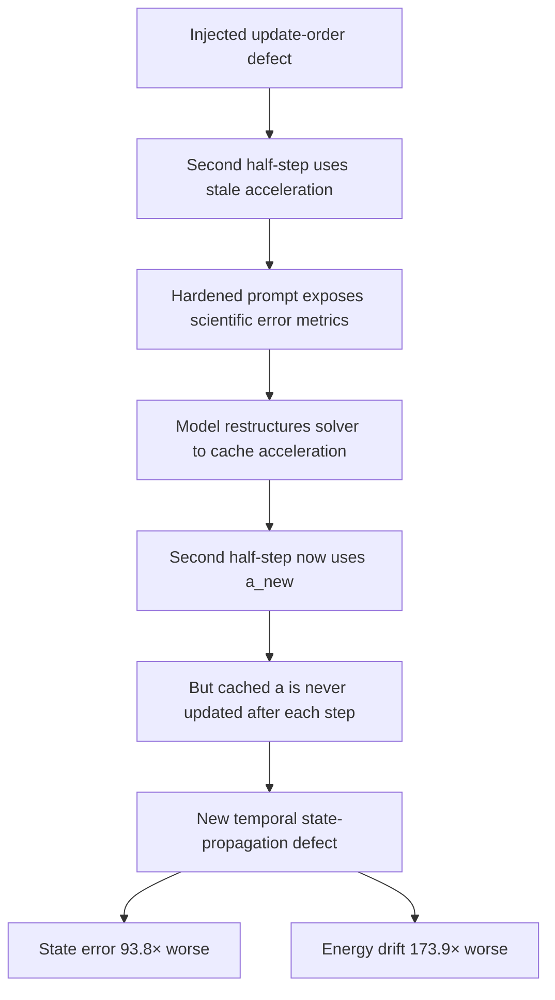

# First Multi-Condition Study Results

**Date:** 2026-09-14  
**Model:** Cohere North Mini Code (free tier)  
**Task:** harmonic oscillator velocity Verlet repair  
**Design:** 3 mutation families × 2 verifier conditions × 3 trials  
**Total attempts:** 18

> This report visualises the first completed multi-condition InvariantLab study. Study 2 subsequently replicated the update-order experiment across Qwen2.5-Coder-7B-Instruct and DeepSeek-Coder-6.7B-Instruct, with 240/240 scientifically correct repairs and no observable condition effect.

---

## Headline result

| Metric | Result |
|---|---:|
| Total repair attempts | **18** |
| Scientifically correct repairs | **17 / 18** |
| Overall scientific pass rate | **94.4%** |
| Weak-condition pass rate | **9 / 9 (100%)** |
| Hardened-condition pass rate | **8 / 9 (88.9%)** |
| Difference, hardened minus weak | **-11.1 percentage points** |
| Scientifically worse-than-baseline repairs | **1 / 18** |

The sample is deliberately small. The result establishes an observed failure mode, not a statistically established general effect.

---

## 1. Scientific repair rate by verifier condition

```text
Weak      9/9  100.0%  ████████████████████
Hardened  8/9   88.9%  ██████████████████░░
```

Approximate Wilson 95% confidence intervals:

| Condition | Passes | Pass rate | Wilson 95% CI |
|---|---:|---:|---:|
| Weak | 9 / 9 | **100.0%** | 70.1% to 100.0% |
| Hardened | 8 / 9 | **88.9%** | 56.5% to 98.0% |

The intervals are wide because there are only nine attempts per condition.

---

## 2. Mutation × condition heatmap

Legend: 🟩 all trials scientifically correct, 🟥 at least one scientific failure

| Mutation family | Weak | Hardened |
|---|:---:|:---:|
| Sign error | 🟩 **3/3** | 🟩 **3/3** |
| Update order | 🟩 **3/3** | 🟥 **2/3** |
| Non-conservative update | 🟩 **3/3** | 🟩 **3/3** |

Only one cell produced a failure: **update-order × hardened**.

---

## 3. Trial-level result matrix

Legend: ✅ scientific pass, ❌ scientific failure

| Mutation | Condition | Trial 1 | Trial 2 | Trial 3 |
|---|---|:---:|:---:|:---:|
| Sign error | Weak | ✅ | ✅ | ✅ |
| Sign error | Hardened | ✅ | ✅ | ✅ |
| Update order | Weak | ✅ | ✅ | ✅ |
| Update order | Hardened | ❌ | ✅ | ✅ |
| Non-conservative | Weak | ✅ | ✅ | ✅ |
| Non-conservative | Hardened | ✅ | ✅ | ✅ |

All successful repairs reported a final state-error value of approximately **3.7 × 10⁻⁵** in the study summary.

---

## 4. Baseline defect severity

Before repair, the three injected mutations had very different scientific severity.

| Mutation family | Baseline max state error | Baseline max energy drift | Qualitative severity |
|---|---:|---:|---|
| Sign error | ~10⁵ | ~10⁷ | Catastrophic |
| Update order | **0.021** | **0.046** | Subtle |
| Non-conservative update | ~10³ | ~10⁴ | Catastrophic |

The only failed repair occurred on the **subtle** defect rather than either catastrophic defect.

---

## 5. The anomalous hardened repair

### Original update-order defect

The baseline defect used the stale acceleration in the second velocity half-step:

```python
a = -omega2 * x
v_half = v + 0.5 * dt * a
x = x + dt * v_half
a_new = -omega2 * x
v = v_half + 0.5 * dt * a
```

Baseline scientific metrics:

```text
max state relative error   0.021
max energy relative drift  0.046
```

### Hardened trial 1 repair

The model changed to a cached-acceleration implementation:

```python
a = -omega2 * x

for _ in range(int(n_steps)):
    v_half = v + 0.5 * dt * a
    x = x + dt * v_half
    a_new = -omega2 * x
    v = v_half + 0.5 * dt * a_new
```

The local second-half-step defect was corrected, but `a` was never updated to `a_new`. From the second iteration onward, the first half-step therefore used stale acceleration.

### Scientific regression

| Metric | Baseline defect | Failed repair | Regression factor |
|---|---:|---:|---:|
| Max state relative error | 0.021 | **1.97** | **93.8× worse** |
| Max energy relative drift | 0.046 | **8.0** | **173.9× worse** |

```text
STATE ERROR
baseline       1.0×  █
failed repair 93.8×  ███████████████████████████████████████████████

ENERGY DRIFT
baseline        1.0× █
failed repair 173.9× ███████████████████████████████████████████████
```

The bar lengths above are schematic because the ratios are too different to display linearly at useful scale. The numeric ratios are the meaningful values.

---

## 6. Failure mechanism



This is more informative than a simple failed-test label. The model repaired the local expression while introducing a new error in the state-update mechanism.

---

## 7. Condition comparison by mutation

### Sign error

```text
Weak      3/3  ████████████████████ 100%
Hardened  3/3  ████████████████████ 100%
```

Every repair restored the correct restoring-force sign:

```python
a = -omega2 * x
```

### Update order

```text
Weak      3/3  ████████████████████ 100%
Hardened  2/3  █████████████░░░░░░░  66.7%
```

This is the only mutation for which the observed outcomes differed by verifier condition.

Approximate Wilson 95% intervals:

| Condition | Passes | Pass rate | Wilson 95% CI |
|---|---:|---:|---:|
| Weak | 3 / 3 | 100.0% | 43.8% to 100.0% |
| Hardened | 2 / 3 | 66.7% | 20.8% to 93.9% |

With only three trials per cell, this difference is not statistically conclusive.

### Non-conservative update

```text
Weak      3/3  ████████████████████ 100%
Hardened  3/3  ████████████████████ 100%
```

All six repairs completed the velocity correction correctly.

---

## 8. What the study supports

The completed study directly supports the following statements:

1. In **17 of 18** attempts, the model produced a scientifically correct repair.
2. The weak condition passed **9 of 9** attempts.
3. The hardened condition passed **8 of 9** attempts.
4. The only failure occurred for the subtle **update-order** mutation under hardened feedback.
5. That failed repair was not merely incomplete. It made the measured state error about **93.8× worse** and energy drift about **173.9× worse** than the original defect.
6. The failed candidate fixed the original local second-half-step expression but introduced a new stale-state propagation bug.

The study does **not** establish that scientific feedback generally harms repair quality. The sample size is too small for that claim.

---

## 9. Interpretation

The result is consistent with several mechanisms that should be separated experimentally:

- **feedback-induced overcorrection:** diagnostic metrics may encourage a broader rewrite than the defect requires
- **prompt complexity:** additional context may alter repair strategy even when the information itself is not causal
- **subtle-defect interaction:** obvious catastrophic defects may be easy enough that extra feedback has little effect, while subtle temporal defects leave more room for restructuring errors
- **model stochasticity/provider variance:** one failure may simply be a rare sample from the model's ordinary repair distribution

The follow-up replication tested these possibilities using four conditions: weak, placebo, raw metrics, and interpreted metrics. It produced 240/240 scientifically correct repairs across two 7B coding models, so the update-order defect saturated and did not discriminate between feedback conditions.

---

## 10. Follow-up result

Study 2 was preregistered in:

[`docs/update-order-feedback-replication.md`](./update-order-feedback-replication.md)

and the completed two-model result is reported in:

[`docs/study-two-model-comparison.md`](./study-two-model-comparison.md)

Both Qwen2.5-Coder-7B-Instruct and DeepSeek-Coder-6.7B-Instruct achieved 120/120
scientifically correct repairs across the four feedback conditions. The update-order
mutation therefore reached a 100% ceiling for both models and is not a useful discriminator
for future feedback-effect experiments.

The first study remains evidence of an observable failure mode, not evidence of a general
causal effect of verifier feedback.
